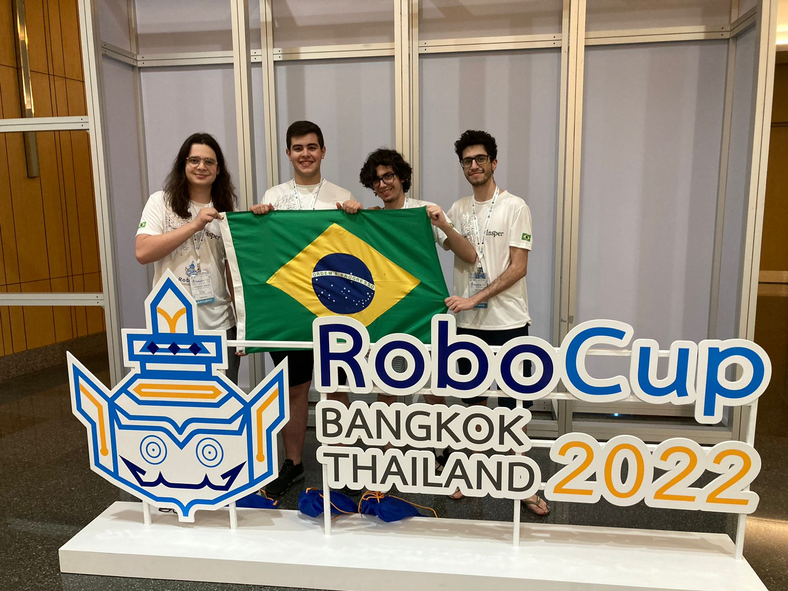
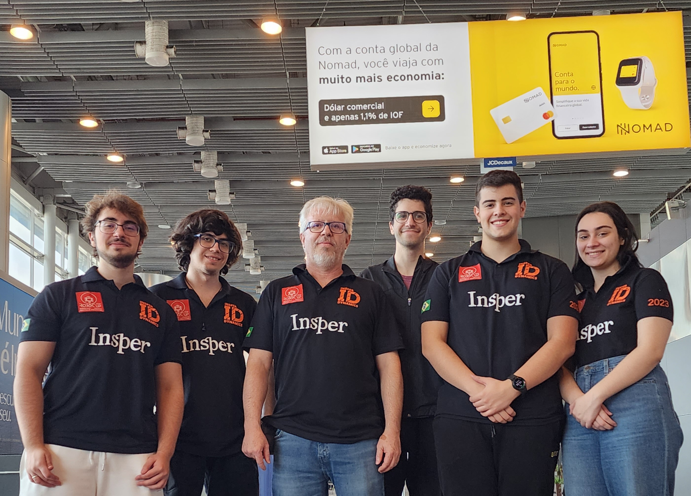

<h1 align="center">
     Hello there! 
</h1>

 

I'm **Enricco Gemha**, a Software Engineer from 🇧🇷 ! 

Since I can remember, I have been allured by the realm of digital techs and games, but, back then, I could only dream about being on the other side, developing those technologies.

Coding since 2019, I've tasted projects in multiple languages and frameworks, like Python (ROS & OpenCV, Pandas & Spark, Django & DjangoRest), JS (Vanilla & React), C and Java. Currently, I'm taking Computer Engineering at [Insper (São Paulo-Brazil)](https://www.insper.edu.br/en/). My main goal as a Software Developer is to contribute to the expansion of digital technologies, which will help improving the quality of life in our society.

Got a job for me? Reach me out on: [riccogemha@gmail.com](mailto:riccogemha@gmail.com).

Wanna chat or discuss about something, check one of my social medias above.

## Languages & Frameworks

## Tools

## Tournaments

### RoboCup 2022 in Bangkok, Thailand 🇹🇭

4th out of 8 in Rescue RMRC and best sensoring in the competition!

### RoboCup 2023 in Bordeaux, France 🇫🇷

4th out of 11 in Rescue RMRC and best mapping in the competition!

## My Stats

| Current Streak 🔥 |
| :-------------------------: |
|  |

| GitHub Stats |
| :-------------------------: |
|  |

| Top Langs |
| :-------------------------: |
|  |

| Gamer-Card |
| :-------------------------: |
|  |
