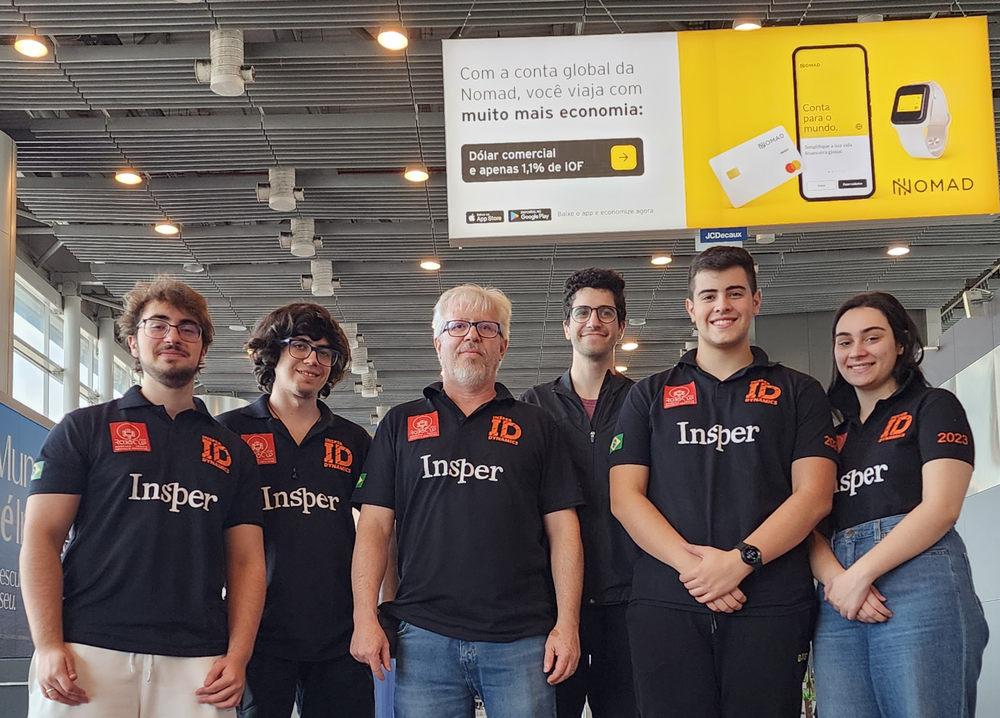
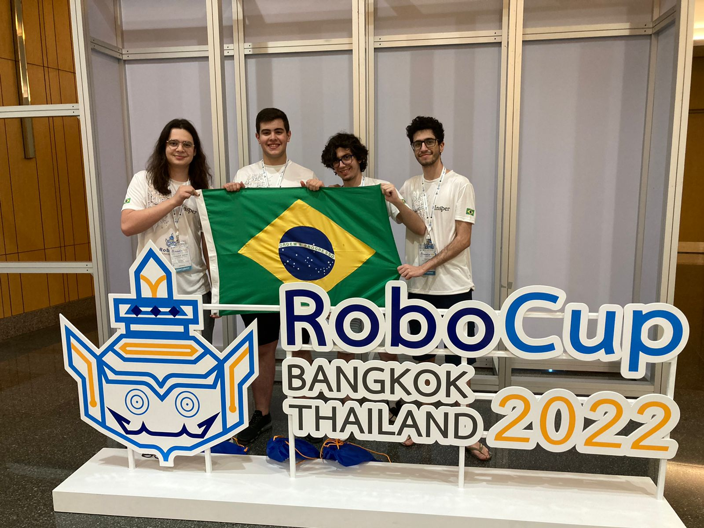

<h1 align="center">
  Hi , I'm Enricco a 🇧🇷 software engineer!
</h1>

  

## 📜 Certifications

## 👨‍💻 Tech Stack

## 🗣️ Languages

- 🇧🇷 Portuguese — Native
- 🇺🇸 English — Native / Bilingual (TOEFL iBT 107/120)
- 🇪🇸 Spanish — Professional working proficiency
- 🇸🇪 Swedish — Elementary

## 🌐 Social Networks

## 💼 Experience

**iOS Engineer · Software Engineer** @ DAERO &nbsp;·&nbsp; _Sep 2025 – Jul 2026_

- Primary engineer on the production iOS app (Swift/SwiftUI): 262 merged PRs (~80% of the codebase history) as the platform scaled from 3 to 25 construction projects and 1,000+ field users.
- Built the offline-first data layer (SQLite/GRDB) and, solo, an OpenTelemetry → ClickHouse/Prometheus/Grafana observability backbone.

**Founder** @ OpenGiving &nbsp;·&nbsp; _May 2025 – Jun 2026_

- Built a hybrid personal-fundraising + marketplace platform — FastAPI/Prisma backend, Next.js frontend, and Stripe Connect escrow.
- Ran it on AWS (ECS Fargate, RDS, CloudFront), fully provisioned with Terraform.

**Cloud Security Engineer, Capstone** @ PinPag &nbsp;·&nbsp; _Jul 2024 – Dec 2024_

- Rebuilt AWS ETL pipelines (Glue/Lambda/Athena) processing 15.9 GB of daily cost reports.
- Deployed a ModSecurity + AWS WAF handling 10K+ daily requests, and added SAST scanning to a GitLab CI/CD pipeline.

**Software Developer Intern** @ QI Tech &nbsp;·&nbsp; _Jul 2024 – Nov 2024_

- Built Python (SQLAlchemy/Falcon) APIs generating Brazil Central Bank regulatory reports from billion-row PostgreSQL tables, cutting 100+ hours of manual work.
- Deployed the supporting infrastructure with Terraform.

## 💻 Projects Developed

| Project | What it is | Links |
| --- | --- | --- |
| **OpenGiving** | Hybrid personal-fundraising + marketplace platform I founded — FastAPI/Prisma backend, Next.js frontend, and Stripe Connect escrow, on AWS (ECS Fargate, RDS, CloudFront) provisioned with Terraform. Shipped with native iOS (Swift) and Android (Kotlin) apps. | [Website](https://opengiving.me) · [App Store](https://apps.apple.com/us/app/opengiving-donate-shop/id6756851957) · [Google Play](https://play.google.com/store/apps/details?id=me.opengiving.android) |
| **Trophy Rooms** | Cross-platform Nintendo Switch achievement & trophy tracker — a Next.js/TypeScript web app (Prisma + PostgreSQL, Clerk auth), a TypeScript GraphQL backend, and a native iOS app (Swift). | [Website](https://trophyrooms.org) · [App Store](https://apps.apple.com/us/app/trophy-rooms/id6799829599) · [Web repo](https://github.com/G3mha/trophy-rooms-web) · [Backend repo](https://github.com/G3mha/trophy-rooms-backend) |
| **Nostalgi** | Multi-vendor marketplace for retro games, modded hardware, and gaming TCGs — an Astro + React storefront and a Go (chi) API on Supabase, with Stripe Connect payouts. | [Website](https://getnostalgi.com) |
| **PacBag** | iOS travel-packing app (Swift/SwiftUI) — create digital twins of your luggage and track items across multiple bags so you never forget essentials. | [Website](https://pacbag.app) · [App Store](https://apps.apple.com/us/app/pacbag-digital-luggage/id6749021887) |
| **Lua Compiler** | A Lua-to-x86-assembly compiler written from scratch in Swift — lexer, parser, and code generation. | [Repo](https://github.com/G3mha/lua-compiler) |
| **Genetic Programming** | Tree-based genetic programming implemented **from scratch in Swift** — parse-tree representation, tournament selection, elitism, and subtree crossover/mutation — then benchmarked head-to-head against a Python implementation on runtime and accuracy. | [Repo](https://github.com/G3mha/genetic-programming) |
| **Pokémon TCG Network Analysis** | Network-science study of the competitive Pokémon TCG scene — web-scraped LimitlessTCG tournament data modeled as a card network, with regression on how card centrality relates to player rankings (Python/Jupyter). | [Repo](https://github.com/G3mha/pokemon-tcg-network-analysis) |
| **AWS + Terraform Infrastructure** | End-to-end AWS infrastructure as code with Terraform — ALB, EC2, RDS MySQL, IAM, security groups, and a Locust load-testing rig, provisioned from scratch. | [Repo](https://github.com/G3mha/aws-terraform-fullstack-webapp) |
| **pwcracker** | A C tool for cracking shadow files via dictionary, rainbow-table, and brute-force techniques. | [Repo](https://github.com/G3mha/pwcracker) |

## 🏆 Achievements

### 🇺🇸 Brown University (2026-27)

- MSc Innovation Management & Entrepreneurship (PRIME), Class of 2027

### 🇺🇸 Olin College of Engineering & Babson College (2025)

- Exchange student in Spring 25

### 🇺🇸 Stanford University (2024)

- Summer Session

### 🇧🇷 Insper Instituto de Ensino e Pesquisa (2021-2025)

- BSc in Computer Engineering

### 🇫🇷 RoboCup (Bordeaux, France) (2023)

- 4th out of 11 teams in Search and Rescue category (Rescue RMRC)
- Awarded Best in class: Mapping
- Awarded Best Team Challenge

### 🇹🇭 RoboCup (Bangkok, Thailand) (2022)

- 4th out of 8 teams in Search and Rescue category (Rescue RMRC)
- Awarded Best in class: Sensoring

### 🇧🇷 AWS DeepRacer League (2022)

- 1st place in Brazil
- 13th place in the world

### 🔭 Brazilian Astronomy Olympiad (OBA)

- Silver Medal (2017)
- Bronze Medal (2020)

 

  
  
  
  
  

