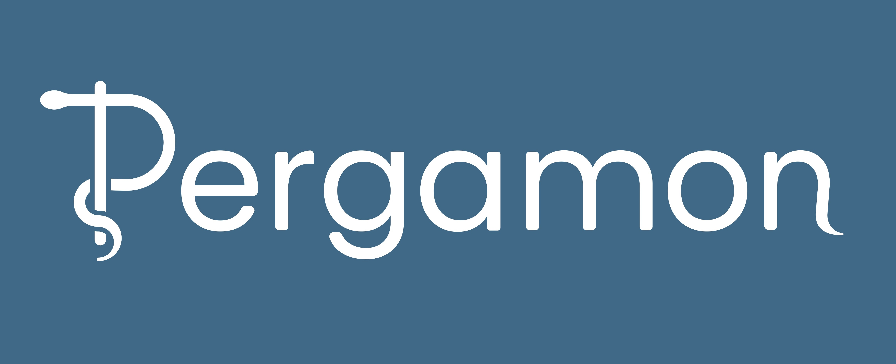

<h1 align="center">
  Hi , I'm Enricco a 🇧🇷 software engineer!
</h1>

[comment]: <> (View Counter)

  

---

 

[comment]: <> (Links to programming languages)
<h3 align="center"><b>👨‍💻 Tech Stack 🔨</h3>

 

[comment]: <> (Links to programming languages)
<h3 align="center"><b>🌐 Social Networks 🌐</h3>

  
  
  
  
  

 

[comment]: <> (Links to other computer related stuff)
<h3 align="center"><b>📱 Projects Developed 💻</h3>

 

---

[comment]: <> (Extend Catistics)

[comment]: <> (Most used languages)

📈 Stats 📉

 

[comment]: <> (Top used languages)

[comment]: <> (GitHub statistics)

[comment]: <> (Current streak)

[comment]: <> (Gamer Card)

---

[comment]: <> (Extend trophies)

🛫 International Achievements 🛬

  <h3 align="center"><b>🇹🇭 RoboCup 2022 in Bangkok, Thailand 🇹🇭</h3>
  
4th out of 8 teams in Rescue RMRC and best sensoring in the competition!

  

   

  <h3 align="center"><b>🇫🇷 RoboCup 2023 in Bordeaux, France 🇫🇷</h3>
  
4th out of 11 teams in Rescue RMRC and best mapping in the competition!

  

---
